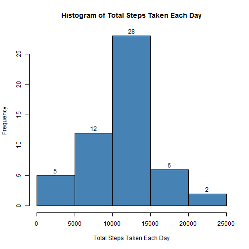
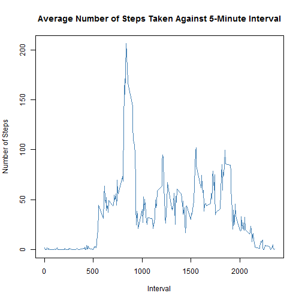
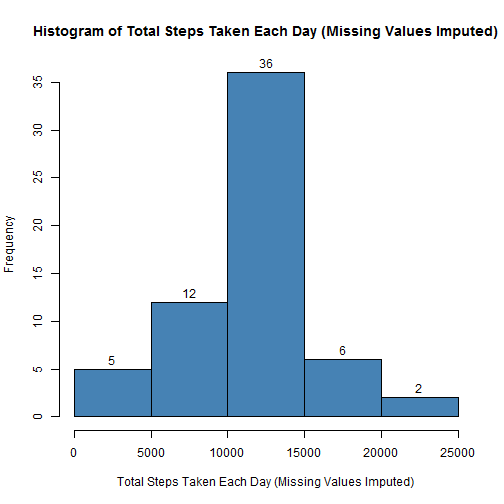
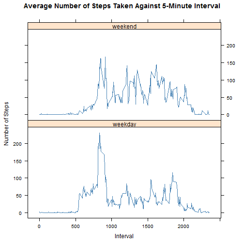

# Reproducible Research: Peer Assessment 1

## Loading and preprocessing the data

1.Unzip and load the data.

```r
unzip("activity.zip")
dt <- read.csv("activity.csv", na.strings = "NA", stringsAsFactors = FALSE)
```

2.Process the data.

```r
dt[, 2] <- as.Date(dt[, 2])
```

## What is mean total number of steps taken per day?

1.Make a histogram of the total number of steps taken each day.

```r
dt1 <- dt[complete.cases(dt), ]
result1 <- data.frame(aggregate(dt1$steps, by = list(as.factor(dt1$date)), FUN = sum))
hist(result1[, 2], labels = TRUE, col = "steelblue", main = "Histogram of Total Steps Taken Each Day", 
     xlab = "Total Steps Taken Each Day")
```

 

2.Calculate and report the mean and median total number of steps taken per day.

```r
mean(result1[, 2])
```

```
## [1] 10766
```

```r
median(result1[, 2])
```

```
## [1] 10765
```


* The **MEAN** total number of steps taken per day is **10766**.
* The **MEDIAN** total number of steps taken per day is **10765**.

## What is the average daily activity pattern?

1.Make a time series plot of the 5-minute interval (x-axis) and the average number 
  of steps taken, averaged across all days (y-axis).

```r
result2 <- data.frame(aggregate(dt1$steps, by = list(as.factor(dt1$interval)), FUN = mean))
result2[, 1] <- as.numeric(as.character(result2[, 1]))
names(result2) <- c("interval", "avg_steps")
plot(result2[, 1],result2[, 2],  type = "l", main = "Average Number of Steps Taken Against 5-Minute Interval",
     xlab = "Interval", ylab = "Number of Steps", col = "steelblue")
```

 

2.Find which 5-minute interval, on average across all the days in the dataset, contains the maximum number of steps.

```r
result2[which.max(result2[, 2]), ]
```

```
##     interval avg_steps
## 104      835     206.2
```


Interval **835** contains the maximum average of **206.2** steps.

## Imputing missing values

1.Calculate and report the total number of missing values in the dataset.

```r
sum(!complete.cases(dt))
```

```
## [1] 2304
```


There are **2304** missing values in the dataset.

2.Devise a strategy for filling in all of the missing values in the dataset.

To fill in all of the missing values, the average number of steps across all days against corresponding 5-minute
interval will be used. These average numbers have been calculated and stored in the data frame "result2".

3.Create a new dataset that is equal to the original dataset but with the missing data filled in.

```r
library(plyr)
names(result2) <- c("interval", "avg_steps")
dt_temp <- join(dt, result2,by = "interval")
steps <- ifelse(is.na(dt_temp[, 1]), dt_temp[, 4], dt_temp[, 1])
dt2 <- cbind(steps,dt[,c(2, 3)])
```

4.Make a histogram of the total number of steps taken each day and Calculate and report the mean and median total 
  number of steps taken per day.

```r
result3 <- data.frame(aggregate(dt2$steps, by = list(as.factor(dt2$date)), FUN = sum))
hist(result3[, 2], labels = TRUE, main = "Histogram of Total Steps Taken Each Day (Missing Values Imputed)", 
     xlab = "Total Steps Taken Each Day (Missing Values Imputed)", col = "steelblue")
```

 


```r
mean(result3[, 2])
```

```
## [1] 10766
```

```r
median(result3[, 2])
```

```
## [1] 10766
```


* The **MEAN** total number of steps taken per day is **10766**.
* The **MEDIAN** total number of steps taken per day is **10766**.

In conclusion, the **MEAN** is the same as the one calculated when omiting the missing values, while the **MEDIAN** is slightly
larger than the one calculated when omiting the missing values. In this example, imputing missing values has pushed the **MEDIAN**
towards the **MEAN**.

## Are there differences in activity patterns between weekdays and weekends?

1.Create a new factor variable in the dataset with two levels - "weekday" and "weekend" indicating whether a given date is a
  weekday or weekend day.

```r
indicator <- ifelse(weekdays(dt2[, 2]) == "Sunday" | weekdays(dt2[, 2]) == "Saturday", "weekend", "weekday")   
dt3 <- cbind(dt2, indicator)
```

2.Make a panel plot containing a time series plot (i.e. type = "l") of the 5-minute interval (x-axis) and the average number
of steps taken, averaged across all weekday days or weekend days (y-axis).

```r
library(lattice)
result4 <- data.frame(aggregate(dt3$steps, by = list(as.factor(dt3$interval), dt3$indicator), FUN = mean))
result4[, 1] <- as.numeric(as.character(result4[, 1]))
xyplot(result4[, 3] ~ result4[, 1] | result4[, 2], main = "Average Number of Steps Taken Against 5-Minute Interval", 
       xlab = "Interval", ylab = "Number of Steps", col = "steelblue", layout = c(1, 2), type = "l")
```

 

